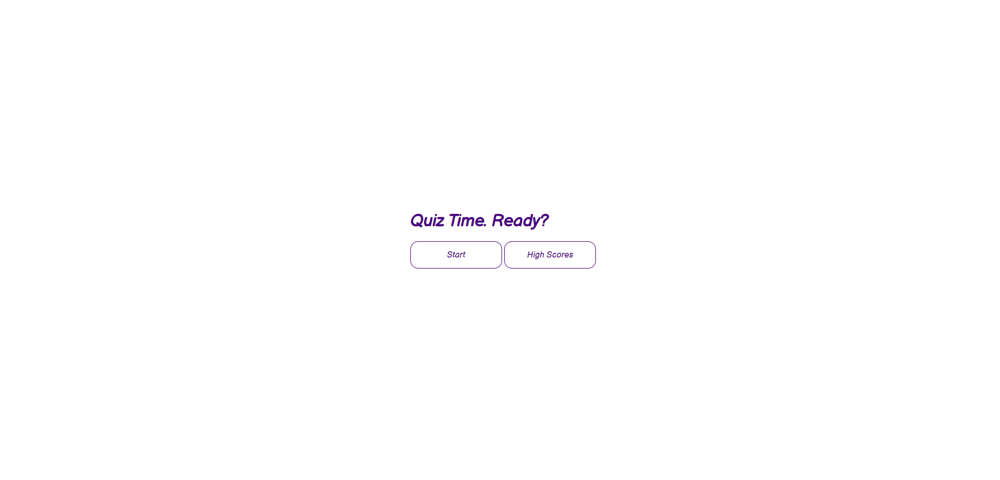
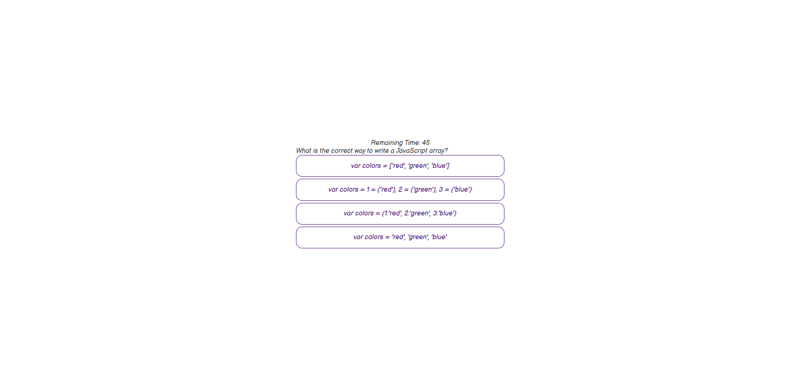
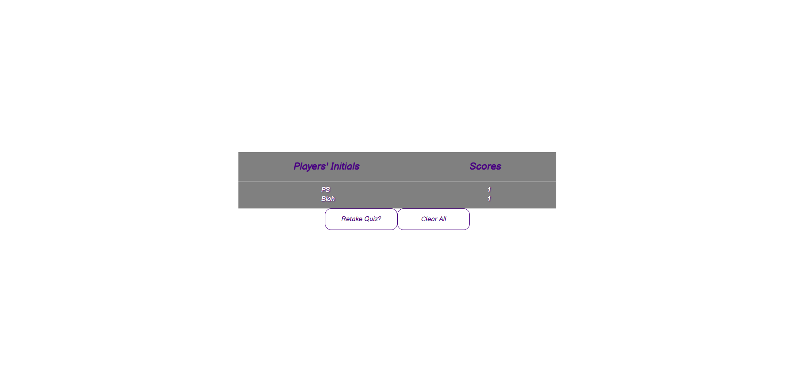

# 
Code-Quiz

## 
Description

This is the homework for week four. The main objective is to develop a responsive application that challenges the user with a timed quiz. The questions are multiple-choice and revolve around javascript fundamentals. The questions will show after the user clicks start or selects an answer. Answering a question incorrectly will result in a penalty of reducing the time left in the timer. The game ends after all the questions are answered or the timer reaches zero seconds. Afterwards the player receives a score out of five and can enter in his or her initials for the score board. The Clear button clears all displayed scores.

## 
Screenshots

## 
Links

https://github.com/LostandConfusedStudent/Code-Quiz
https://lostandconfusedstudent.github.io/Code-Quiz/
